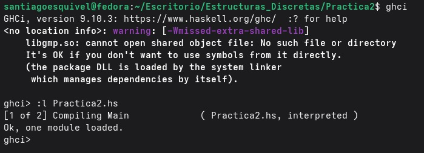

# Práctica 2 *Thinking in Haskell (Introducción)*

* Alumno: Esquivel Cruz Santiago 
* Semestre: 2027-1

## Objetivo de la práctica 

Ir conociendo cual es la sintaxis que se usa en el lenguaje Haskell asi como el uso de algunas funciones básicas (operaciones aritmeticas y condicionales) en la resolución de problemas simples 

* Tiempo empleado en esta práctica: de 3-4 horas por romperme la cabeza para que compilara el código 

## Cargar en GHCi

